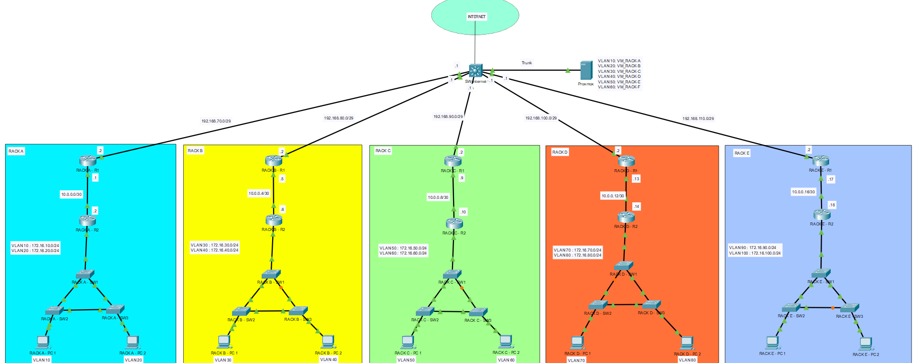

# Réseaux 4 – Hiver 2026

Sur cette page GitHub, vous trouverez les laboratoires qui compteront comme des mini-projets pour le cours de Réseaux 4. Vous trouverez ici les topologies sur lesquelles vous allez travailler ainsi que la configuration des serveurs que nous allons utiliser pour les services de chaque rack.

Je vous invite fortement à créer des tickets dans la section Issues afin que je puisse vous aider à clarifier vos questions.

Veuillez garder à l’esprit que ce répertoire est toujours en développement.

Pour communiquer avec moi directement, vous pouvez me joindre à l’adresse suivante : msipah@lacitec.on.ca

## Topologie utilisée pour les laboratoires 1 à 4

## Serveurs pour les racks

Pour chaque rack, il y a un serveur Ubuntu. Il s’agit d’une machine virtuelle qui fonctionne sur le serveur Proxmox. Elle est configurée avec une adresse IP statique et exécute plusieurs services, tels que : HTTP, DNS, DHCP, NTP, Syslog et TFTP.

Si vous avez des services que vous jugez intéressants à installer, veuillez créer un ticket en fournissant tous les détails nécessaires.

Caractéristiques des serveurs :

1 cœur (CPU)

3 Go de RAM

32 Go d’espace disque

## Déploiement des services

Les services sont déployés de façon automatisée. Pour le déploiement, nous utilisons Ansible, qui est un outil d’automatisation. Si vous souhaitez effectuer des changements, je vous conseille de les ajouter au playbook Ansible afin d’éviter de les faire manuellement… sauf si vous voulez faire les changements sur 6 serveurs à la main 😂

Dans le dossier Ansible, vous trouverez deux fichiers :

un fichier contenant l’inventaire (les adresses IP des serveurs)

un autre fichier contenant le playbook, qui regroupe les tâches à déployer sur les serveurs

Je ne suis pas un expert avec Ansible; je suis en train de l’apprendre en même temps que je monte le laboratoire. Donc, si vous avez des suggestions, je suis ouvert à vos opinions.