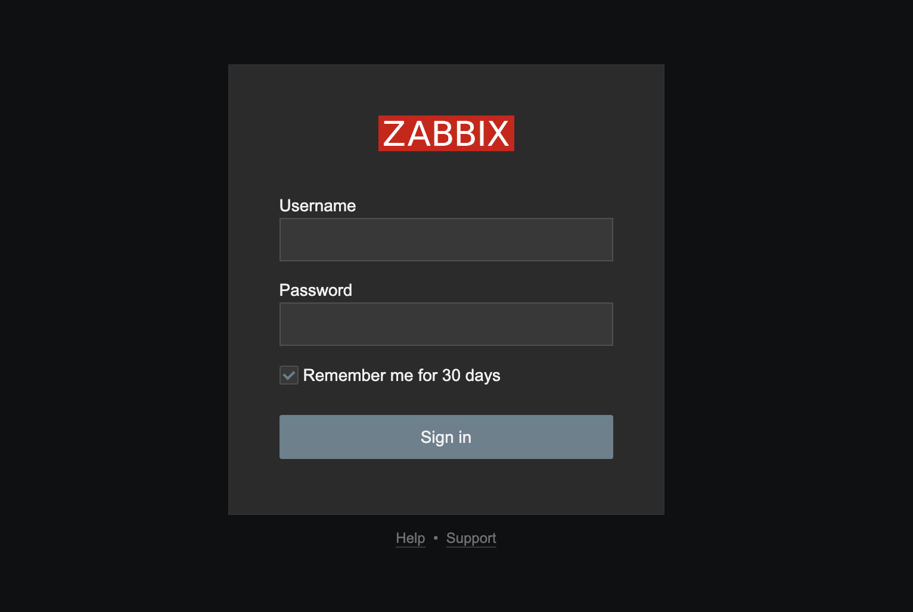
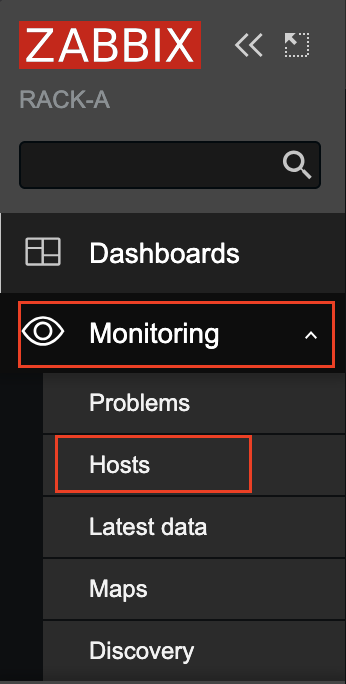
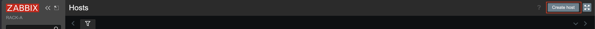
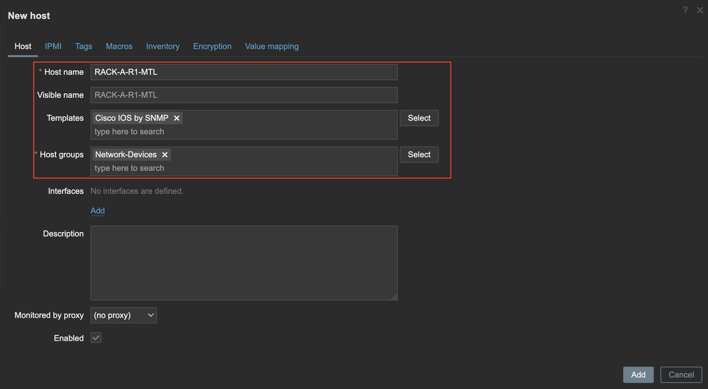
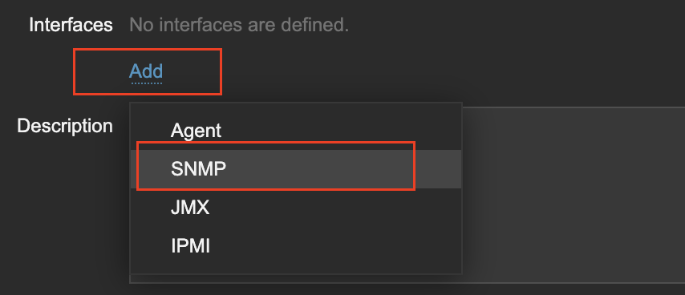
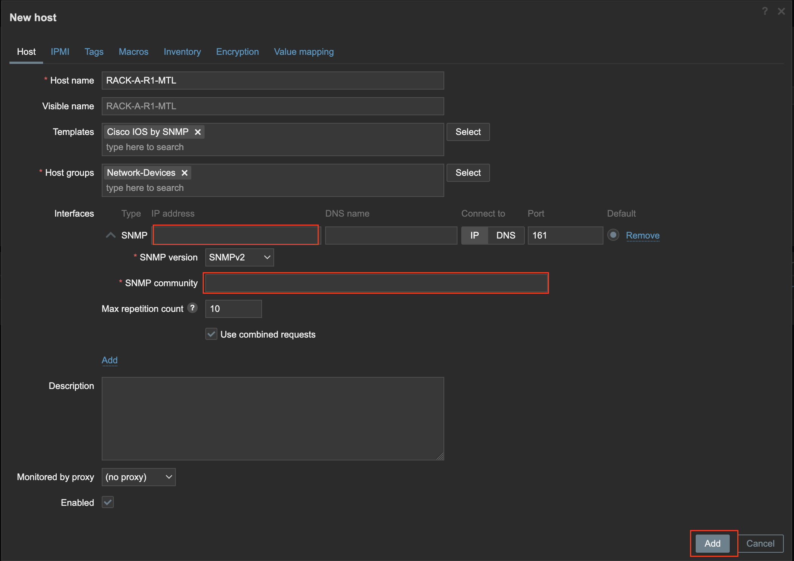
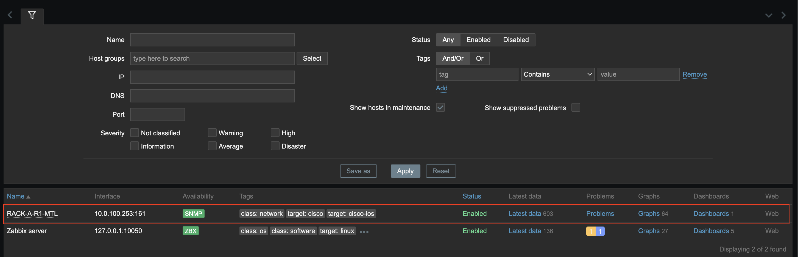
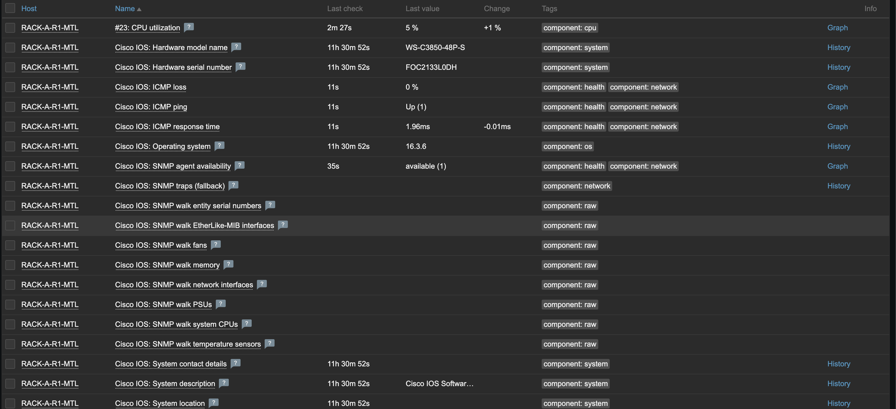

# Ajouter un client SNMP sur Zabbix

1. Connectez-vous au serveur Zabbix en utilisant l’adresse suivante : rack-x.local/zabbix.

    Utilisez les identifiants suivants :
    
    • Nom d’utilisateur : Admin

    • Mot de passe : zabbix

🔴 Note: le « x » représente la lettre de votre rack.

2. Accédez à la section "Hosts" dans l’onglet "Monitoring".

    

3. Cliquez sur "Create host".

    

4. Ajouter le nom de l’appareil que vous souhaitez ajouter, puis sélectionner le template "Cisco IOS by SNMP" et le groupe d’hôtes "Network-Devices".

    

5. Cliquez sur "Add" dans la section "Interfaces" et sélectionnez "SNMP".

    

6. Saisissez l’adresse IP de l’appareil ainsi que le nom de la communauté que vous avez créée, puis cliquez sur "Add".

    

7. Vous devez voir un appareil ajouté et l’état SNMP doit être en vert.

    

8. Vous pouvez maintenant cliquer sur la section "Latest data" pour voir toutes les données que Zabbix a pu collecter.

    

 