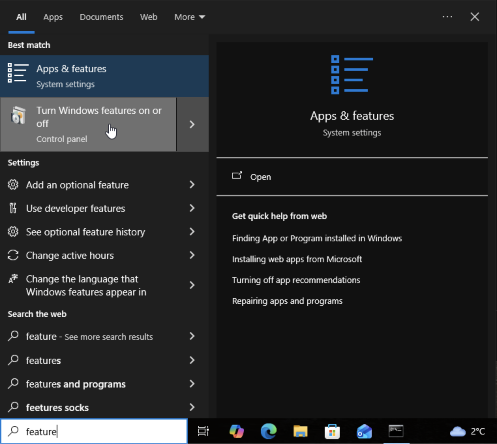
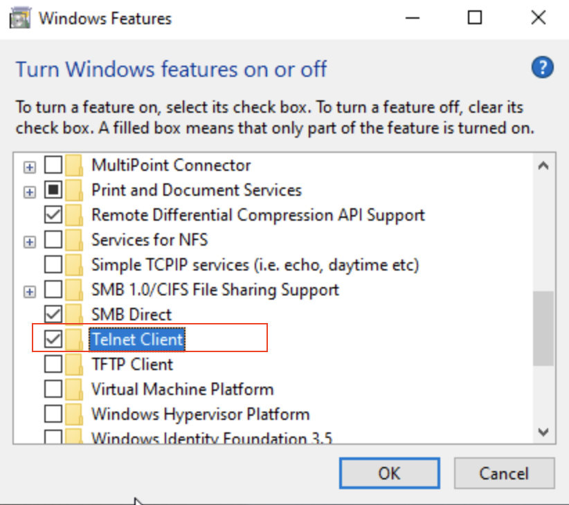
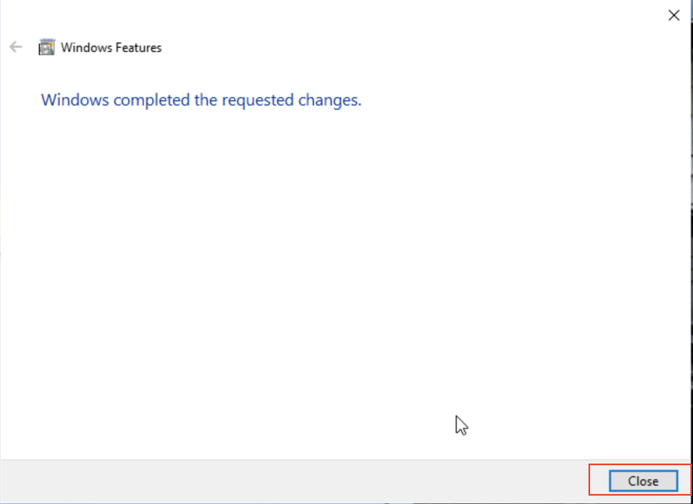
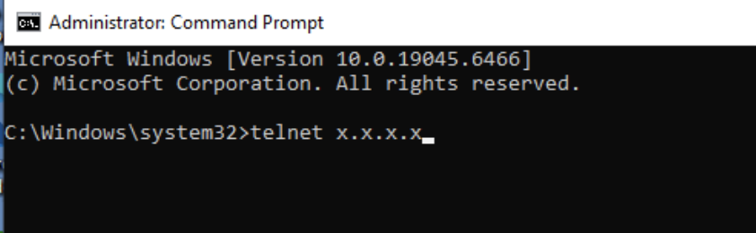

# Comment se connecter avec Telnet sur Windows 10

1 . Dans la barre de recherche, recherchez « Turn Windows features on or off ».

2 . Dans la liste, recherchez Telnet, cochez le service, puis cliquez sur OK.

3 . Attendez que le service soit installé, puis cliquez sur Close.

4 . Pour démarrer une connexion Telnet, ouvrez cmd et tapez telnet, suivi de l’adresse IP du serveur.

