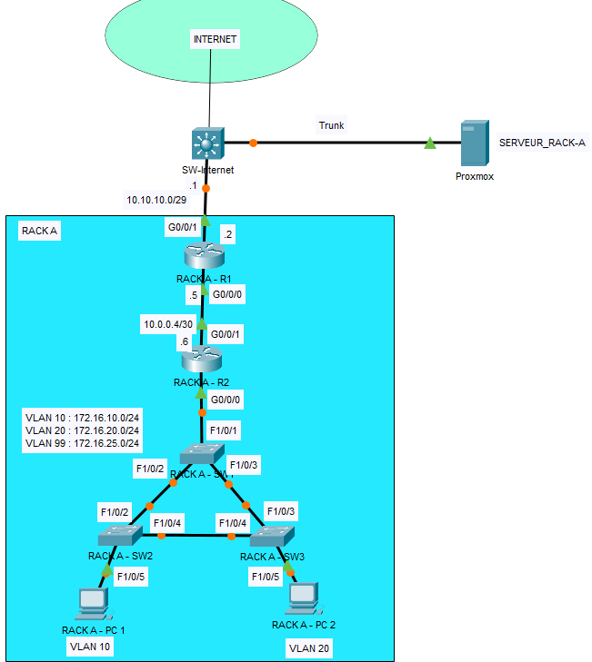

# Laboratoire 2 - Configuration des ACL étendues et standards, OSPF, SSH

# Topologie

# Table d’adressage :

|Equipments|Interface     | IP Address     | Subnet Mask     | Default Gateway | Description
|----------|--------------|---------------|----------------|------------------|------------------|
|RACK-A-R1 |G0/0/1   |10.10.10.2       |255.255.255.248           | N/A|Connexion a internet via la switch
|          |G0/0/0   |10.0.0.5   |255.255.255.252| N/A|Connexion au routeur R2
|RACK-A-R2 |G0/0/1   |10.0.0.6   |255.255.255.252| N/A|Connexion au routeur R1
|          |G0/0/0.10|172.16.10.1|255.255.255.0  | N/A|Connexion au switch SW1 - VLAN 10
|          |G0/0/0.20|172.16.20.1|255.255.255.0  | N/A|Connexion au switch SW1 - VLAN 20
|RACK-A-PC1|Fa0      |DHCP       |DHCP  | DHCP   |    |
|RACK-A-PC2|Fa0      |DHCP       |DHCP  | DHCP   |    |

# Table VLAN
|Equipments|VLAN     | Nom VLAN    |
|----------|--------------|---------------|
|RACK-A-SW1, RACK-A-SW2 et RACK-A-SW3|VLAN 10| VLAN10
|          |VLAN 20| VLAN10
|          |VLAN 99| Mgmt_Native

# Table de ports
|Equipments|Ports |  |
|----------|-----|----------|
|RACK-A-SW1 |F1/0/1, F1/0/2, F1/0/3| Trunk
|RACK-A-SW2 |F1/0/2, F1/0/4| Trunk
||F1/0/5| Vlan 10
|RACK-A-SW3 |F1/0/3, F1/0/4| Trunk
||F1/0/5| Vlan 20

# Étape 1 – Configuration des paramètres de base
a. Configurez les noms d’hôte (hostname)

c. Désactivez la résolution des noms de domaine

d. Désactivez le délai d’attente sur la console

e. Activez la synchronisation des messages de la console

# Étape 2 – Configuration des VLANs et assignation des ports du switch			
a. À l’aide des tableaux des VLANs et des ports, configurez les VLANs et les ports.

# Étape 3 – Configuration des adresses IP et du routage inter-VLAN
a. À l’aide du tableau d’adresses IP, configurez les adresses IP.

b. Configurez le routage inter-VLAN et attribuez la première adresse IP disponible de chaque réseau aux sous-interfaces du routeur RACK-A-R2

# Étape 4 – Configuration du routage statique et dynamique 
a. Configurez le routage OSPF sur tous les routeurs.

•   Utilisez le numéro de processus ID 1 et la zone 0.

•   Annoncez dans OSPF uniquement les réseaux connectés à chaque routeur, sauf le réseau qui mène vers SW-Internet.

•   Configurez les interfaces passives aux endroits appropriés.

b. Sur RACK-A-R1, configurez une route par défaut pointant vers SW-Internet en utilisant l’interface de sortie. Sur RACK-A-R1, utilisez la commande appropriée pour propager cette route par défaut à ses voisins OSPF.

# Étape 5 – Configuration du DHCP 
Le serveur DHCP est déjà configuré pour vous. Son adresse IP est la suivante : 192.168.10.200
Vous devez configurer IP Helper pour qu’il pointe vers ce serveur DHCP.

# Étape 6 – Configuration de SSH 					
a. Configurez SSH sur le routeur RACK-A-R1.

b. Définissez le nom de domaine à rack-a.local

c. Créez un utilisateur cisco avec le mot de passe cisco1234.

d. Créez une clé RSA 2048 bits.

e. Version 2

f. Paramétrez toutes les lignes vty 0 4 pour utiliser SSH et un login local

# Étape 7 – Configuration des ACL standards	
Écrire une ACL standard nommée ALLOW_SSH qui permettra seulement au RACK A-PC1 de faire une connexion SSH sur RACK-A-R1. Toute tentatives de connexion via SSH depuis tout autre périphérique doit échouer.

# Étape 8 – Configuration des ACL étendues

🔴 Avant de commencer les ACL, assurez-vous de faire les tests sur les deux PC. Par exemple :

🔴 Accéder à une page web en HTTP et HTTPS.

🔴 Vérifier que le DNS fonctionne correctement.

🔴 Essayer de vous connecter au serveur en utilisant Telnet et FTP.

Écrire une ACL étendue nommée DROITS-PC qui donne les accès suivants: 

•	Pour RACK A-PC1: autorise le trafic Telnet (23), DNS (53), DHCP(67, 68), HTTP (80) et HTTPS (443) sur le serveur 192.168.10.200, tout autre trafic partant de RACK A-PC1 vers le serveur externe est refusé.

•	Pour RACK A-PC2: autorise le trafic FTP (20, 21) et DHCP(67, 68) sur le serveur 192.168.10.200.

•	Appliquer la ACL convenablement.

# Captures à remettre dans le pigeonnier

a. Faites la commande show vlan brief sur tous les switches.

b. Faites la commande show ip interface brief sur tous les routeurs.

c. Faites la commande show ip route sur tous les routeurs.

d. Faites la commande ipconfig sur les PC.

e. Faites la commande show ip access-list sur le routeur RACK-A-R2, on doit voir des (match).