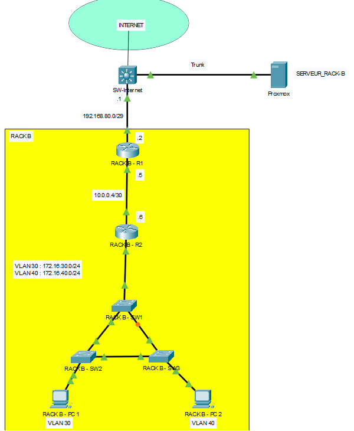

# Laboratoire 3 - Configuration des ACL étendues, OSPF, SSH et NAT

# Topologie

# Table d’adressage :

|Equipments|Interface     | IP Address     | Subnet Mask     | Default Gateway | Description
|----------|--------------|---------------|----------------|------------------|------------------|
|RACK-B-R1 |G0/0/1   |10.10.10.10       |255.255.255.248           | N/A|Connexion a internet via la switch
|          |G0/0/0   |10.0.0.9   |255.255.255.252| N/A|Connexion au routeur R2
|RACK-B-R2 |G0/0/1   |10.0.0.10   |255.255.255.252| N/A|Connexion au routeur R1
|          |G0/0/0.30|172.16.30.1|255.255.255.0  | N/A|Connexion au switch SW1 - VLAN 30
|          |G0/0/0.40|172.16.40.1|255.255.255.0  | N/A|Connexion au switch SW1 - VLAN 40
|RACK-B-PC1|Fa0      |172.16.30.100       |255.255.255.0  |172.16.30.1   |    |
|RACK-B-PC2|Fa0      |172.16.40.100       |255.255.255.0  |172.16.40.1   |    |

Note: utiliser le serveur 192.168.10.200 pour DNS

# Table VLAN
|Equipments|VLAN     | Nom VLAN    |
|----------|--------------|---------------|
|RACK-B-SW1, RACK-B-SW2 et RACK-B-SW3|VLAN 30| VLAN30
|          |VLAN 40| VLAN40
|          |VLAN 99| Mgmt_Native

# Table de ports
|Equipments|Ports |  |
|----------|-----|----------|
|RACK-B-SW1 |F1/0/1, F1/0/2, F1/0/3| Trunk
|RACK-B-SW2 |F1/0/2, F1/0/4| Trunk
||F1/0/5| Vlan 30
|RACK-B-SW3 |F1/0/3, F1/0/4| Trunk
||F1/0/5| Vlan 40

# Étape 1 – Configuration des paramètres de base
a. Configurez les noms d’hôte (hostname)

c. Désactivez la résolution des noms de domaine

d. Désactivez le délai d’attente sur la console

e. Activez la synchronisation des messages de la console

# Étape 2 – Configuration des VLANs et assignation des ports du switch			
a. À l’aide des tableaux des VLANs et des ports, configurez les VLANs et les ports.

# Étape 3 – Configuration des adresses IP et du routage inter-VLAN
a. À l’aide du tableau d’adresses IP, configurez les adresses IP.

b. Configurez le routage inter-VLAN et attribuez la première adresse IP disponible de chaque réseau aux sous-interfaces du routeur RACK-B-R2

# Étape 4 – Configuration du routage statique et dynamique 
a. Configurez le routage OSPF sur tous les routeurs.

•   Utilisez le numéro de processus ID 1 et la zone 0.

•   Annoncez dans OSPF uniquement les réseaux connectés à chaque routeur, sauf le réseau qui mène vers SW-Internet.

•   Configurez les interfaces passives aux endroits appropriés.

b. Sur RACK-B-R1, configurez une route par défaut pointant vers SW-Internet en utilisant l’interface de sortie. Sur RACK-B-R1, utilisez la commande appropriée pour propager cette route par défaut à ses voisins OSPF.

# Étape 5 – Configuration de SSH 					
a. Configurez SSH sur le routeur RACK-B-R1.

b. Définissez le nom de domaine à rack-b.local

c. Créez un utilisateur cisco avec le mot de passe cisco1234.

d. Créez une clé RSA 2048 bits.

e. Version 2

f. Paramétrez toutes les lignes vty 0 4 pour utiliser SSH et un login local

# Étape 6 – Configuration du NAT
a.	Créer une liste d’accès standard nommée NAT pour permettre les réseaux du 
VLAN 30, du VLAN 40 et interdire tout autres réseaux.

b.	Créer un NAT pool nommée NAT-POOL entre les adresses 10.10.10.11 et 10.10.10.13.

c.	Créer un NAT statique pour le serveur RACK-B-PC1 avec l’adresse 10.10.10.14.

d.	Tester le NAT avant de continuer.

🔴 Connectez-vous en SSH au serveur 192.168.20.200 en utilisant l’utilisateur "user" et le mot de passe "cisco1234", puis essayez de pinguer le PC RACK-B-PC1.

🔴 Essayez ensuite de pinguer 8.8.8.8 à travers les PC.

🔴 Essayez d’ouvrir la page Web google.ca.

🔴 Si tous vos tests sont concluants, vous pouvez continuer avec les ACL étendues.

# Étape 7 – Configuration des ACL étendues	
Écrire une ACL étendue nommée FIREWALL qui donne les accès suivants: 

•	Appliquer la ACL convenablement sur le routeur RACK-B-R1.

•	Autorise le retour du trafic FTP (ports 20 et 21), DNS (53), HTTPS (443) du serveur externe (192.168.20.200) au réseaux privés.

•	Autorise les pings du serveur externe (192.168.20.200) vers le serveur RACK-B-PC1.

•	Interdire tout autres trafics.
