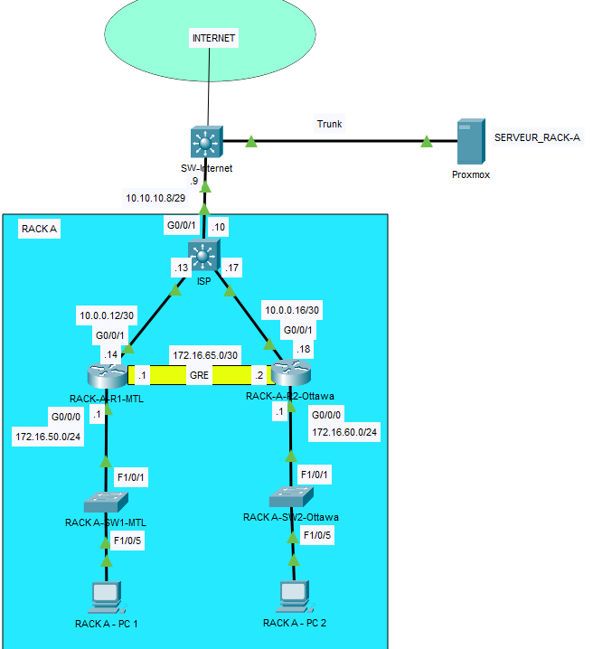

# Laboratoire 7 - Configuration GRE, NAT, QoS 
# Topologie

# Table d’adressage :

|Equipments|Interface     | IP Address     | Subnet Mask     | Default Gateway | Description
|----------|--------------|---------------|----------------|------------------|------------------|
|ISP |G1/0/1   |10.10.10.10       |255.255.255.248         | N/A|Connexion a internet 
|          |G1/0/2   |10.0.0.13   |255.255.255.252| N/A|Connexion a RACK-B-R1-MTL
|          |G1/0/3   |10.0.0.17   |255.255.255.252| N/A|Connexion a RACK-B-R2-Ottawa
|RACK-B-R1-MTL |G0/0/1   |10.0.0.14       |255.255.255.252           | N/A|Connexion a ISP
|          |G0/0/0   |172.16.30.1   |255.255.255.0| N/A|Connexion au switch RACK B-SW-MTL
|          |Tunnel 1   |172.16.45.1   |255.255.255.252| N/A|Connexion Tunnel au RACK-B-R2-Ottawa
|RACK-B-R2-Ottawa |G0/0/1   |10.0.0.18   |255.255.255.252| N/A|Connexion a ISP
|          |G0/0/0|172.16.40.1|255.255.255.0  | N/A|Connexion au switch RACK B-SW-Ottawa
|          |Tunnel 1   |172.16.45.2   |255.255.255.252| N/A|Connexion Tunnel au RACK-B-R1-MTL
|RACK-B-PC1|Fa0      |172.16.30.100       |255.255.255.0  | 172.16.30.1   |    |
|RACK-B-PC2|Fa0      |172.16.40.100       |255.255.255.0  | 172.16.40.1   |    |

Note: utiliser le serveur 192.168.20.200 pour DNS

# Étape 1 – Configuration des paramètres de base
a. Configurez les noms d’hôte (hostname)

# Étape 2 – Configuration des adresses IP
a. À l’aide du tableau d’adresses IP, configurez les adresses IP.

# Étape 3 – Configuration du routage statique
a. Sur ISP, configurez une route par défaut route entièrement spécifiée pointant vers SW-Internet.

b. Sur RACK-B-R1-MTL, configurez une route par défaut route entièrement spécifiée pointant vers ISP.

c. Sur RACK-B-R2-Ottawa, configurez une route par défaut route entièrement spécifiée pointant vers ISP.

# Étape 4 – Configuration du tunnel GRE
a. Configurer le tunnel GRE entre les routeurs RACK-B-R1-MTL et RACK-B-R2-Ottawa

# Étape 5 – Configuration du routage dynamique 
a. Configurez le routage OSPF sur tous les routeurs RACK-B-R1-MTL et RACK-B-R2-Ottawa.

•   Utilisez le numéro de processus ID 1 et la zone 0.

•   Annoncez dans OSPF uniquement les réseaux connectés, sauf les réseaux qui mène vers ISP.

•   Configurez les interfaces passives aux endroits appropriés.

# Étape 6 – Configuration du NAT sur RACK-B-R1-MTL et RACK-B-R2-Ottawa
a.	Créer une liste d’accès standard nommée NAT sur RACK-B-R1-MTL pour permettre le réseau
172.16.30.0/24 et interdire tout autres réseaux.

b.	Configurer le NAT avec PAT sur l'interface de sortie de RACK-B-R1-MTL.

a.	Créer une liste d’accès standard nommée NAT sur RACK-B-R2-Ottawa pour permettre le réseau
172.16.40.0/24 et interdire tout autres réseaux.

b.	Configurer le NAT avec PAT sur l'interface de sortie de RACK-B-R2-Ottawa.

d.	Tester le NAT avant de continuer.

# Étape 7 – Configuration du QoS
a.  Créer une liste d’accès étendue nommée QoS sur RACK-B-R1-MTL afin de faire correspondre le trafic provenant du réseau 172.16.30.0/24 vers n’importe quelle destination sur le port 443.

b.  Créer une class-map nommée HTTPS sur RACK-B-R1-MTL afin de faire correspondre le trafic défini dans l’ACL QoS.

c.  Créer une policy-map nommée HTTPS-QoS sur RACK-B-R1-MTL afin d’allouer 60 % de la bande passante au trafic HTTPS.

d.  Appliquer la policy-map sur l’interface pointant vers Internet sur le routeur RACK-B-R1-MTL.

e.  Créer une liste d’accès étendue nommée QoS sur RACK-B-R2-Ottawa afin de faire correspondre le trafic provenant du réseau 172.16.40.0/24 vers n’importe quelle destination sur le port 443.

f.  Créer une class-map nommée HTTPS sur RACK-B-R2-Ottawa afin de faire correspondre le trafic défini dans l’ACL QoS.

g.  Créer une policy-map nommée HTTPS-QoS sur RACK-B-R2-Ottawa afin d’allouer 60 % de la bande passante au trafic HTTPS.

h.  Appliquer la policy-map sur l’interface pointant vers Internet sur le routeur RACK-B-R2-Ottawa.

# Captures à remettre dans le pigeonnier

a. Vous devez effectuer un traceroute entre le PC RACK-B-PC1 et le PC RACK-B-PC2. Le trafic doit passer à travers le tunnel.

b. Vous devez effectuer un traceroute entre le PC RACK-B-PC1 et google.com. Le trafic ne doit pas passer dans le tunnel.

c. Vous devez effectuer un traceroute entre le PC RACK-B-PC2 et google.com. Le trafic ne doit pas passer dans le tunnel.

d. Ouvrir www.google.com dans le navigateur web sur RACK-B-PC1.

e. Ouvrir www.google.com dans le navigateur web sur RACK-B-PC2.

f. Exécuter la commande show policy-map interface G0/0/1 sur RACK-B-R1-MTL.

g. Exécuter la commande show policy-map interface G0/0/1 sur RACK-B-R2-Ottawa.