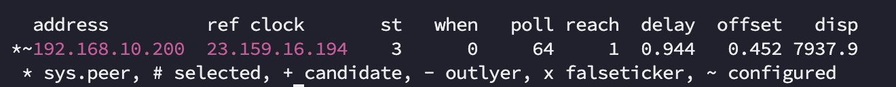

# Laboratoire 7 - Configuration GRE, NAT, QoS 
# Topologie

# Table d’adressage :

|Equipments|Interface     | IP Address     | Subnet Mask     | Default Gateway | Description
|----------|--------------|---------------|----------------|------------------|------------------|
|ISP |G1/0/1   |10.10.10.10       |255.255.255.248         | N/A|Connexion a internet 
|          |G1/0/2   |10.0.0.13   |255.255.255.252| N/A|Connexion a RACK-B-R1-MTL
|          |G1/0/3   |10.0.0.17   |255.255.255.252| N/A|Connexion a RACK-B-R2-Ottawa
|RACK-B-R1-MTL |G0/0/1   |10.0.0.14       |255.255.255.252           | N/A|Connexion a ISP
|          |G0/0/0   |172.16.30.1   |255.255.255.0| N/A|Connexion au switch RACK B-SW-MTL
|          |Tunnel 1   |172.16.45.1   |255.255.255.252| N/A|Connexion Tunnel au RACK-B-R2-Ottawa
|RACK-B-R2-Ottawa |G0/0/1   |10.0.0.18   |255.255.255.252| N/A|Connexion a ISP
|          |G0/0/0|172.16.40.1|255.255.255.0  | N/A|Connexion au switch RACK B-SW-Ottawa
|          |Tunnel 1   |172.16.45.2   |255.255.255.252| N/A|Connexion Tunnel au RACK-B-R1-MTL
|RACK-B-SW1-MTL |SVI  |172.16.30.2   |255.255.255.0| 172.16.30.1|
|RACK-B-SW2-Ottawa |SVI  |172.16.40.2   |255.255.255.0| 172.16.40.1|
|RACK-B-PC1|Fa0      |172.16.30.100       |255.255.255.0  | 172.16.30.1   |    |
|RACK-B-PC2|Fa0      |172.16.40.100       |255.255.255.0  | 172.16.40.1   |    |

Note: utiliser le serveur 192.168.20.200 pour DNS

# Étape 1 – Configuration des paramètres de base
a. Configurez les noms d’hôte (hostname)

# Étape 2 – Configuration des adresses IP
a. À l’aide du tableau d’adresses IP, configurez les adresses IP.

# Étape 3 – Configuration du routage statique
a. Sur ISP, configurez une route par défaut route entièrement spécifiée pointant vers SW-Internet.

b. Sur RACK-B-R1-MTL, configurez une route par défaut route entièrement spécifiée pointant vers ISP.

c. Sur RACK-B-R2-Ottawa, configurez une route par défaut route entièrement spécifiée pointant vers ISP.

# Étape 4 – Configuration du tunnel GRE
a. Configurer le tunnel GRE entre les routeurs RACK-B-R1-MTL et RACK-B-R2-Ottawa

# Étape 5 – Configuration du routage dynamique 
a. Configurez le routage OSPF sur tous les routeurs RACK-B-R1-MTL et RACK-B-R2-Ottawa.

•   Utilisez le numéro de processus ID 1 et la zone 0.

•   Annoncez dans OSPF uniquement les réseaux connectés, sauf les réseaux qui mène vers ISP.

•   Configurez les interfaces passives aux endroits appropriés.

# Étape 6 – Configuration du NAT sur RACK-B-R1-MTL et RACK-B-R2-Ottawa
a.	Créer une liste d’accès standard nommée NAT sur RACK-B-R1-MTL pour permettre le réseau
172.16.30.0/24 et interdire tout autres réseaux.

b.	Configurer le NAT avec PAT sur l'interface de sortie de RACK-B-R1-MTL.

a.	Créer une liste d’accès standard nommée NAT sur RACK-B-R2-Ottawa pour permettre le réseau
172.16.40.0/24 et interdire tout autres réseaux.

b.	Configurer le NAT avec PAT sur l'interface de sortie de RACK-B-R2-Ottawa.

d.	Tester le NAT avant de continuer.

# Étape 7 – Configuration NTP.

a.  Configurer les routeurs et les commutateurs afin qu’ils utilisent le serveur de votre rack en tant que serveur NTP.

# Étape 8 – Configuration Syslog.

a.  Configurer les routeurs et les commutateurs afin qu’ils utilisent le serveur de votre rack en tant que serveur Syslog.

# Étape 9 – Configuration des ACL étendues sur RACK-B-R1-MTL et RACK-B-R2-Ottawa

🔴 Avant de commencer les ACL, assurez-vous de faire les tests sur les deux PC. Par exemple :

🔴 Accéder à une page web www.rack-b.local en HTTP et HTTPS.

🔴 Accéder à une page web google.com en HTTP et HTTPS.

🔴 Vérifier que le DNS fonctionne correctement.

🔴 Essayer de vous connecter au serveur en utilisant [FTP](../../documentation/ftp_connection.md) et SSH

Écrire une ACL étendue nommée FIREWALL qui donne les accès suivants: 

•	Autorise le trafic FTP (ports 20 et 21), SSH (22), DNS (53), HTTPS (443) ainsi que le NTP provenant du serveur externe (192.168.20.200) à retourner.

•   Autorise le trafic GRE entre les routeurs.

•	Interdire tout autres trafics.

# Captures à remettre dans le pigeonnier

a. Vous devez effectuer un traceroute entre le PC RACK-B-PC1 et le PC RACK-B-PC2. Le trafic doit passer à travers le tunnel.

b. Vous devez effectuer un traceroute entre le PC RACK-B-PC1 et google.com. Le trafic ne doit pas passer dans le tunnel.

c. Vous devez effectuer un traceroute entre le PC RACK-B-PC2 et google.com. Le trafic ne doit pas passer dans le tunnel.

d. Exécuter la commande "show ip access-list" sur les routeurs RACK-B-R1-MTL et RACK-B-R2-Ottawa. On doit voir des match sur toutes les lignes.

e. Exécuter la commande "show ntp associations" sur les routeurs RACK-B-R1-MTL, RACK-B-R2-Ottawa, RACK-B-SW1-MTL et RACK-B-SW2-Ottawa. Vous devriez voir un résultat similaire à celui-ci.

f. Connectez-vous au serveur et déplacez-vous dans le dossier suivant "/var/log/remote". Exécutez la commande "ls" pour voir les répertoires. Vous devriez voir un répertoire pour chaque routeur et pour chaque switch.
