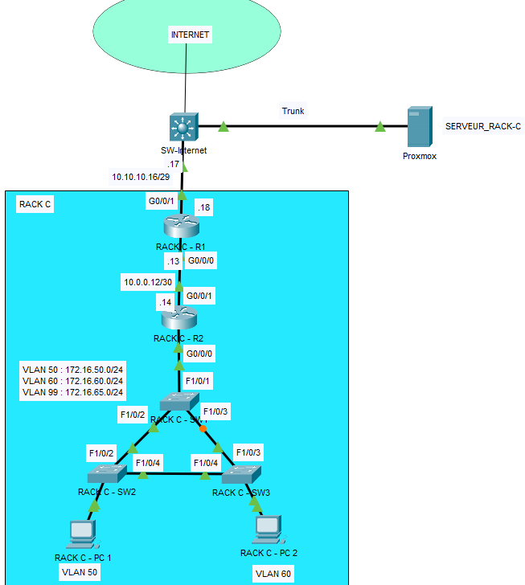

# Laboratoire 1 - Configuration des ACL étendues et standards, OSPF, SSH

# Topologie

# Table d’adressage :

|Equipments|Interface     | IP Address     | Subnet Mask     | Default Gateway | Description
|----------|--------------|---------------|----------------|------------------|------------------|
|RACK-C-R1 |G0/0/1   |10.10.10.18       |255.255.255.248           | N/A|Connexion a internet via la switch
|          |G0/0/0   |10.0.0.13   |255.255.255.252| N/A|Connexion au routeur R2
|RACK-C-R2 |G0/0/1   |10.0.0.14   |255.255.255.252| N/A|Connexion au routeur R1
|          |G0/0/0.50|172.16.50.1|255.255.255.0  | N/A|Connexion au switch SW1 - VLAN 50
|          |G0/0/0.60|172.16.60.1|255.255.255.0  | N/A|Connexion au switch SW1 - VLAN 60
|RACK-C-PC1|Fa0      |DHCP       |DHCP  | DHCP   |    |
|RACK-C-PC2|Fa0      |DHCP       |DHCP  | DHCP   |    |

# Table VLAN
|Equipments|VLAN     | Nom VLAN    |
|----------|--------------|---------------|
|RACK-C-SW1, RACK-C-SW2 et RACK-C-SW3|VLAN 50| VLAN50
|          |VLAN 60| VLAN60
|          |VLAN 99| Mgmt_Native

# Table de ports
|Equipments|Ports |  |
|----------|-----|----------|
|RACK-C-SW1 |F1/0/1, F1/0/2, F1/0/3| Trunk
|RACK-C-SW2 |F1/0/2, F1/0/4| Trunk
||F1/0/5| Vlan 50
|RACK-C-SW3 |F1/0/3, F1/0/4| Trunk
||F1/0/5| Vlan 60

# Étape 1 – Configuration des paramètres de base
a. Configurez les noms d’hôte (hostname)

c. Désactivez la résolution des noms de domaine

d. Désactivez le délai d’attente sur la console

e. Activez la synchronisation des messages de la console

# Étape 2 – Configuration des VLANs et assignation des ports du switch			
a. À l’aide des tableaux des VLANs et des ports, configurez les VLANs et les ports.

# Étape 3 – Configuration des adresses IP et du routage inter-VLAN
a. À l’aide du tableau d’adresses IP, configurez les adresses IP.

b. Configurez le routage inter-VLAN et attribuez la première adresse IP disponible de chaque réseau aux sous-interfaces du routeur RACK-C-R2

# Étape 4 – Configuration du routage statique et dynamique 
a. Configurez le routage OSPF sur tous les routeurs.

•   Utilisez le numéro de processus ID 1 et la zone 0.

•   Annoncez dans OSPF uniquement les réseaux connectés à chaque routeur, sauf le réseau qui mène vers SW-Internet.

•   Configurez les interfaces passives aux endroits appropriés.

b. Sur RACK-C-R1, configurez une route par défaut pointant vers SW-Internet en utilisant l’interface de sortie. Sur RACK-C-R1, utilisez la commande appropriée pour propager cette route par défaut à ses voisins OSPF.

# Étape 5 – Configuration du DHCP 
Le serveur DHCP est déjà configuré pour vous. Son adresse IP est la suivante : 192.168.30.200
Vous devez configurer IP Helper pour qu’il pointe vers ce serveur DHCP.

# Étape 6 – Configuration de SSH 					
a. Configurez SSH sur le routeur RACK-C-R1.

b. Définissez le nom de domaine à rack-c.local

c. Créez un utilisateur cisco avec le mot de passe cisco1234.

d. Créez une clé RSA 2048 bits.

e. Version 2

f. Paramétrez toutes les lignes vty 0 4 pour utiliser SSH et un login local

# Étape 7 – Configuration des ACL standards	
Configurez une ACL standard nommée ACL_VLAN50 qui filtre selon les critères suivants :

•	Empêche le réseau 172.16.50.0/24 d’accéder au réseau 172.16.60.0/24

•	Tout autre trafic est permis

•	Appliquez la ACL au meilleur endroit pour être le plus efficace (selon les meilleurs pratiques)

# Étape 8 – Configuration des ACL étendues
Configurez une ACL étendu numérotée 100 qui :

•	Bloque le traffic web en provenance du réseau 172.16.50.0/24 vers le serveur le web 192.168.30.200 (on souhaite ici interdit l’accès aux pages web).

•	Tout autre type de traffic est autorisé

# Captures à remettre dans le pigeonnier

a. Faites la commande show vlan brief sur tous les switches.
b. Faites la commande show ip interface brief sur tous les routeurs.
c. Faites la commande show ip route sur tous les routeurs.
d. Faites la commande ipconfig sur les PC.
e. Effectuez un ping du PC VLAN 50 au PC VLAN 60.
f. Effectuez un ping du PC VLAN 50 au serveur 192.168.30.200.