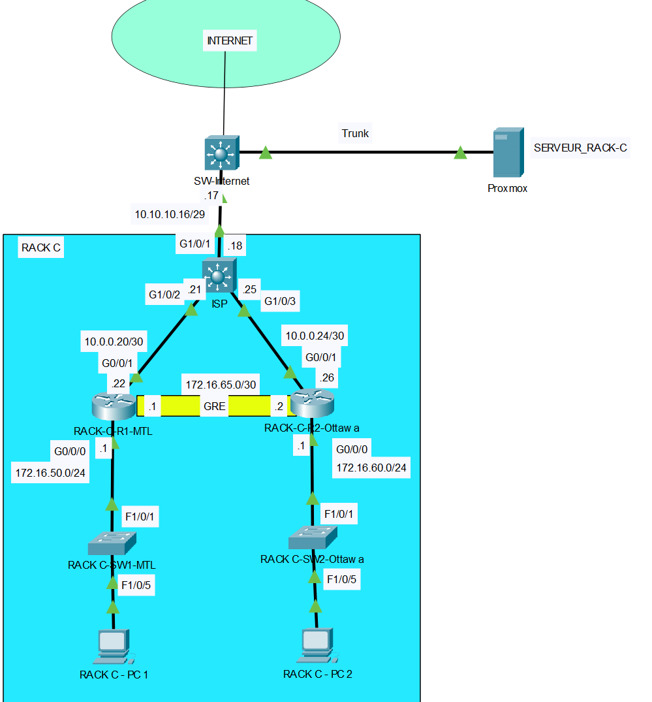

# Laboratoire 11 - Configuration GRE, OSPF, NAT, SNMP, ACL et TFTP
# Topologie

# Table d’adressage :

|Equipments|Interface     | IP Address     | Subnet Mask     | Default Gateway | Description
|----------|--------------|---------------|----------------|------------------|------------------|
|ISP |G1/0/1   |10.10.10.18       |255.255.255.248         | N/A|Connexion a internet 
|          |G1/0/2   |10.0.0.21   |255.255.255.252| N/A|Connexion a RACK-C-R1-MTL
|          |G1/0/3   |10.0.0.25   |255.255.255.252| N/A|Connexion a RACK-C-R2-Ottawa
|RACK-C-R1-MTL |G0/0/1   |10.0.0.22       |255.255.255.252           | N/A|Connexion a ISP
|          |G0/0/0   |172.16.50.1   |255.255.255.0| N/A|Connexion au switch RACK C-SW-MTL
|          |Tunnel 1   |172.16.65.1   |255.255.255.252| N/A|Connexion Tunnel au RACK-C-R2-Ottawa
|RACK-C-R2-Ottawa |G0/0/1   |10.0.0.26   |255.255.255.252| N/A|Connexion a ISP
|          |G0/0/0|172.16.60.1|255.255.255.0  | N/A|Connexion au switch RACK C-SW-Ottawa
|          |Tunnel 1   |172.16.65.2   |255.255.255.252| N/A|Connexion Tunnel au RACK-C-R1-MTL
|RACK-C-SW1-MTL |SVI  |172.16.50.2   |255.255.255.0| 172.16.50.1|
|RACK-C-SW2-Ottawa |SVI  |172.16.60.2   |255.255.255.0| 172.16.60.1|
|RACK-C-PC1|Fa0      |172.16.50.100       |255.255.255.0  | 172.16.50.1   |    |
|RACK-C-PC2|Fa0      |172.16.60.100       |255.255.255.0  | 172.16.60.1   |    |

Note: utiliser le serveur 192.168.30.200 pour DNS

# Étape 1 – Configuration des paramètres de base
a. Configurez les noms d’hôte (hostname)

# Étape 2 – Configuration des adresses IP
a. À l’aide du tableau d’adresses IP, configurez les adresses IP.

# Étape 3 – Configuration du routage statique
a. Sur ISP, configurez une route par défaut route entièrement spécifiée pointant vers SW-Internet.

b. Sur RACK-C-R1-MTL, configurez une route par défaut route entièrement spécifiée pointant vers ISP.

c. Sur RACK-C-R2-Ottawa, configurez une route par défaut route entièrement spécifiée pointant vers ISP.

# Étape 4 – Configuration du tunnel GRE
a. Configurer le tunnel GRE entre les routeurs RACK-C-R1-MTL et RACK-C-R2-Ottawa

# Étape 5 – Configuration du routage dynamique 
a. Configurez le routage OSPF sur tous les routeurs RACK-C-R1-MTL et RACK-C-R2-Ottawa.

•   Utilisez le numéro de processus ID 1 et la zone 0.

•   Annoncez dans OSPF uniquement les réseaux connectés, sauf les réseaux qui mène vers ISP.

•   Configurez les interfaces passives aux endroits appropriés.

# Étape 6 – Configuration du NAT sur RACK-C-R1-MTL et RACK-C-R2-Ottawa
a.	Créer une liste d’accès standard nommée NAT sur RACK-C-R1-MTL pour permettre le réseau
172.16.50.0/24 et interdire tout autres réseaux.

b.	Configurer le NAT avec PAT sur l'interface de sortie de RACK-C-R1-MTL.

a.	Créer une liste d’accès standard nommée NAT sur RACK-C-R2-Ottawa pour permettre le réseau
172.16.60.0/24 et interdire tout autres réseaux.

b.	Configurer le NAT avec PAT sur l'interface de sortie de RACK-C-R2-Ottawa.

d.	Tester le NAT avant de continuer.

# Étape 7 – Configuration SNMP

a. Configurer une communauté read-only nommée "rack-c" sur les routeurs RACK-C-R1-MTL et RACK-C-R2-Ottawa.

b. Configurer le serveur Zabbix pour se connecter aux routeurs RACK-C-R1-MTL et RACK-C-R2-Ottawa. Suivre la documentation.

# Étape 8 – Configuration des ACL étendues sur RACK-C-R1-MTL et RACK-C-R2-Ottawa

🔴 Avant de commencer les ACL, assurez-vous de faire les tests sur les deux PC. Par exemple :

🔴 Accéder à une page web www.rack-c.local en HTTP et HTTPS.

🔴 Accéder à une page web google.com en HTTP et HTTPS.

🔴 Vérifier que le DNS fonctionne correctement.

🔴 Essayer de vous connecter au serveur en utilisant [FTP](../../documentation/ftp_connection.md) et SSH

Écrire une ACL étendue nommée ACL-LAN-TO-WAN qui donne les accès suivants: 

•	Autoriser le trafic FTP (ports 20 et 21), SSH (22), DNS (53), HTTPS (443), HTTP (80) et TFTP (69) provenant des réseaux locaux vers le serveur externe (192.168.30.200).

•	Autoriser le trafic HTTPS (443) et HTTP (80) provenant des réseaux locaux vers n’importe quelle destination.

•	Autorise le trafic HTTPS (443) et HTTP (80) provenant des reseaux loceau vers n'import quelle destination.

•	Refuser le trafic HTTP (80) provenant des réseaux locaux vers le serveur hackme.computcenter.ca.

•	Interdire tout autres trafics.

# Étape 9 – Sauvegarde des configurations sur le serveur TFTP

a. Effectuer la sauvegarde des configurations des routeurs et des commutateurs vers le serveur TFTP (192.168.30.200).

# Captures à remettre dans le pigeonnier

a. Vous devez effectuer un traceroute entre le PC RACK-C-PC1 et le PC RACK-C-PC2. Le trafic doit passer à travers le tunnel.

b. Vous devez effectuer un traceroute entre le PC RACK-C-PC1 et www.rack-c.local
. Le trafic ne doit pas passer dans le tunnel.

c. Vous devez effectuer un traceroute entre le PC RACK-C-PC2 et www.rack-c.local
. Le trafic ne doit pas passer dans le tunnel.

d. Ouvrir www.google.com
 dans le navigateur web sur RACK-C-PC1. Vous devez être capable d’ouvrir cette page.

e. Ouvrir www.google.com
 dans le navigateur web sur RACK-C-PC2. Vous devez être capable d’ouvrir cette page.

f. Ouvrir hackme.computcenter.ca dans le navigateur web sur RACK-C-PC1. Vous ne devez pas être capable d’ouvrir cette page.

g. Ouvrir hackme.computcenter.ca dans le navigateur web sur RACK-C-PC2. Vous ne devez pas être capable d’ouvrir cette page.

h. Prenez une capture d’écran de la page web de Zabbix montrant vos appareils qui ont été ajoutés.

i. Connectez-vous au serveur 192.168.30.200 en SSH, puis déplacez-vous dans le dossier « /backup ». Exécutez la commande « ls » pour voir les configurations de chaque routeur et switch. Exécutez ensuite un « cat » sur un des fichiers afin de vérifier les configurations.

    Utilisez les identifiants suivants :
    
    • Nom d’utilisateur : user

    • Mot de passe : cisco1234

j. Exécuter la commande "show ip access-lists" sur les routeurs RACK-C-R1-MTL et RACK-C-R2-Ottawa. Vous devez voir des correspondances (matches) sur toutes les lignes.