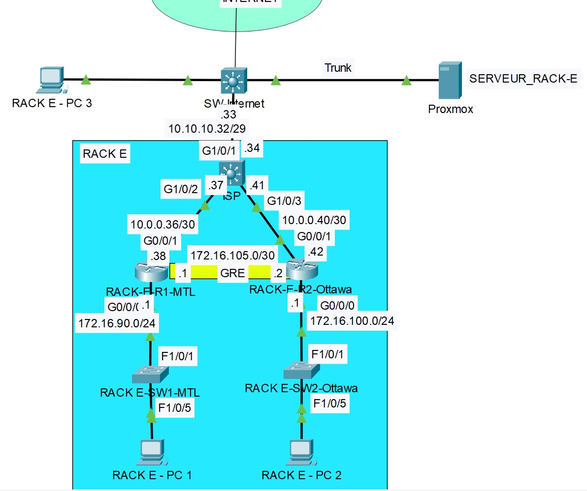

# Laboratoire 12 - Automatisation
# Topologie

# Table d’adressage :

|Equipments|Interface     | IP Address     | Subnet Mask     | Default Gateway | Description
|----------|--------------|---------------|----------------|------------------|------------------|
|ISP |G1/0/1   |10.10.10.34       |255.255.255.248         | N/A|Connexion a internet 
|          |G1/0/2   |10.0.0.37   |255.255.255.252| N/A|Connexion a RACK-E-R1-MTL
|          |G1/0/3   |10.0.0.41   |255.255.255.252| N/A|Connexion a RACK-E-R2-Ottawa
|RACK-E-R1-MTL |G0/0/1   |10.0.0.38       |255.255.255.252           | N/A|Connexion a ISP
|          |G0/0/0   |172.16.90.1   |255.255.255.0| N/A|Connexion au switch RACK E-SW-MTL
|          |Tunnel 1   |172.16.105.1   |255.255.255.252| N/A|Connexion Tunnel au RACK-E-R2-Ottawa
|RACK-E-R2-Ottawa |G0/0/1   |10.0.0.42   |255.255.255.252| N/A|Connexion a ISP
|          |G0/0/0|172.16.100.1|255.255.255.0  | N/A|Connexion au switch RACK E-SW-Ottawa
|          |Tunnel 1   |172.16.105.2   |255.255.255.252| N/A|Connexion Tunnel au RACK-E-R1-MTL
|RACK-E-PC1|Fa0      |172.16.90.100       |255.255.255.0  | 172.16.90.1   |    |
|RACK-E-PC2|Fa0      |172.16.100.100       |255.255.255.0  | 172.16.100.1   |    |

Note: utiliser le serveur 192.168.50.200 pour DNS

# Étape 1 – Configuration des paramètres de base
a. Configurez les noms d’hôte (hostname)

b. Configurez le mot de passe « class » pour le mode privilégié.

# Étape 2 – Configuration des adresses IP
a. À l’aide du tableau d’adresses IP, configurez les adresses IP de ISP.

b. À l’aide du tableau d’adresses IP, configurez uniquement les adresses IP sur l’interface G0/0/1 des routeurs RACK-E-R1-MTL et RACK-E-R2-Ottawa.

# Étape 3 – Configuration du routage statique
a. Sur ISP, configurez une route par défaut route entièrement spécifiée pointant vers SW-Internet.

b. Sur RACK-E-R1-MTL, configurez une route par défaut route entièrement spécifiée pointant vers ISP.

c. Sur RACK-E-R2-Ottawa, configurez une route par défaut route entièrement spécifiée pointant vers ISP.

# Étape 4 – Configurez SSH sur le routeur RACK-E-R1-MTL et RACK-E-R2-Ottawa.

a. Définissez le nom de domaine à rack-e.local

b. Créez un utilisateur « user » avec le mot de passe « cisco1234 ».

c. Créez une clé RSA 2048 bits.

d. Version 2

e. Paramétrez toutes les lignes vty 0 4 pour utiliser SSH et un login local

# Étape 5 – Automatisation des tâches

a. À l’aide du RACK-E-PC3, connectez-vous au serveur 192.168.50.200 en SSH en utilisant le nom d’utilisateur « user » et le mot de passe « cisco1234 ».

b. Exécutez la commande suivante pour télécharger le dépôt GitHub sur le serveur.

git clone https://github.com/nadersip/Reseaux4.git

c. Déplacez-vous dans le répertoire Reseaux4/laboratoires/rack_e/laboratoire12.

d. Exécutez la commande suivante pour configurer le routeur RACK-E-R1-MTL.

ansible-playbook config_rack_e_r1_mtl.yaml -i inventory.ini

e. Exécutez la commande suivante pour configurer le routeur RACK-E-R2-Ottawa.

ansible-playbook config_rack_e_r2_ottawa.yaml -i inventory.ini

🔴 Exécutez la commande show run pour vous assurer que les configurations sont bien présentes sur les routeurs.

# Étape 6 – Configuration SNMP
a. Configurer le serveur Zabbix pour se connecter aux routeurs RACK-E-R1-MTL et RACK-E-R2-Ottawa. Suivre la documentation [SNMP](../../documentation/snmp_client.md).

# Étape 7 – Sauvegarde des configurations sur le serveur TFTP

a. Effectuer la sauvegarde des configurations des routeurs vers le serveur TFTP (192.168.50.200).

# Captures à remettre dans le pigeonnier

a. Vous devez effectuer un traceroute entre le PC RACK-E-PC1 et le PC RACK-E-PC2. Le trafic doit passer à travers le tunnel.

b. Vous devez effectuer un traceroute entre le PC RACK-E-PC1 et www.rack-e.local. Le trafic ne doit pas passer dans le tunnel.

c. Vous devez effectuer un traceroute entre le PC RACK-E-PC2 et www.rack-e.local. Le trafic ne doit pas passer dans le tunnel.

d. Ouvrir www.google.com dans le navigateur web sur RACK-E-PC1. Vous devez être capable d’ouvrir cette page.

e. Ouvrir www.google.com dans le navigateur web sur RACK-E-PC2. Vous devez être capable d’ouvrir cette page.

f. Ouvrir hackme.computcenter.ca dans le navigateur web sur RACK-E-PC1. Vous ne devez pas être capable d’ouvrir cette page.

g. Ouvrir hackme.computcenter.ca dans le navigateur web sur RACK-E-PC2. Vous ne devez pas être capable d’ouvrir cette page.

h. Prenez une capture d’écran de la page web de Zabbix montrant vos appareils qui ont été ajoutés.

i. Connectez-vous au serveur 192.168.50.200 en SSH, puis déplacez-vous dans le dossier « /backup ». Exécutez la commande « ls » pour voir les configurations de chaque routeur et switch. Exécutez ensuite un « cat » sur un des fichiers afin de vérifier les configurations.

    Utilisez les identifiants suivants :
    
    • Nom d’utilisateur : user

    • Mot de passe : cisco1234

j. Exécuter la commande "show ip access-lists" sur les routeurs RACK-E-R1-MTL et RACK-E-R2-Ottawa. Vous devez voir des correspondances (matches) sur toutes les lignes.

